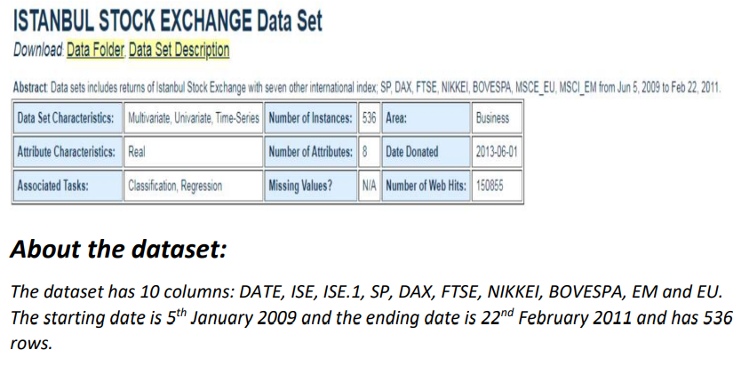
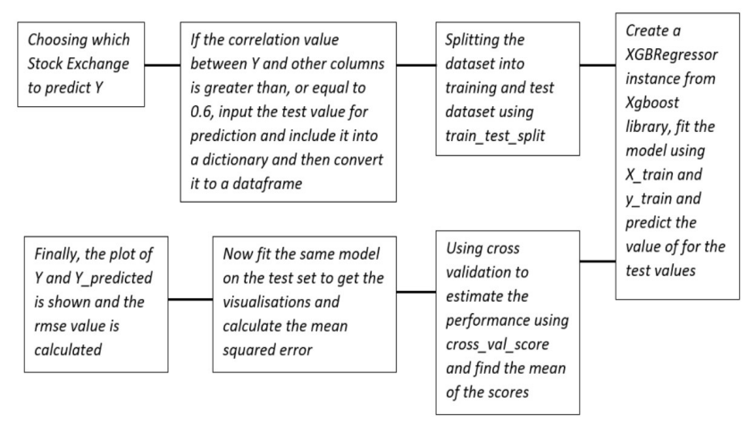
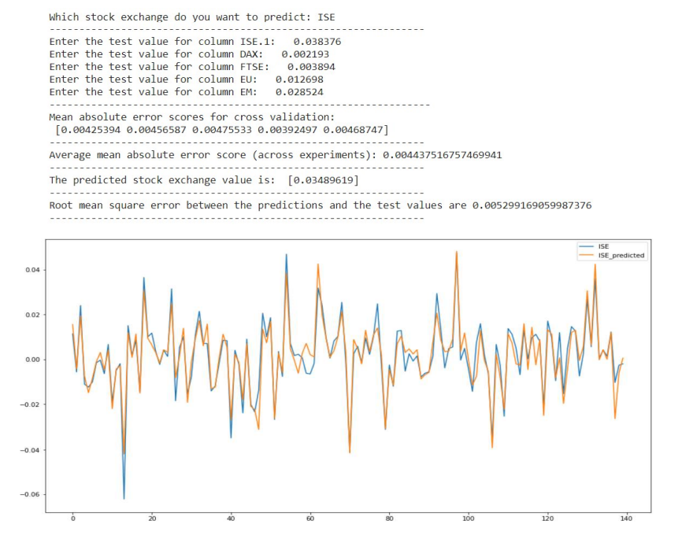

# Time-series-analysis
### Name of the project: Analysing and predicting the Istanbul stock market dataset
##### Repository: UCI machine learning repository 
#### About: 
- The objective of this project is to **predict the value of a stock exchange**, when the values of 
the other stock exchanges are given. Using statistical models like ARIMA, VAR and machine 
learning models like XGBoost, trying to find the model for best prediction.

- Tools used:
    - Python - sklearn for model building
    - IDE - Google Colab notebooks

-   The links for the code, algorithms used and accuracy of the model are:
    1) ARIMA model - [Link](https://github.com/JayB-7/Time-series-analysis/blob/main/ISE_analysis_ARIMA.ipynb)
    2) VAR model - [Link](https://github.com/JayB-7/Time-series-analysis/blob/main/multivariate_analysis_ISE.ipynb)
    3) XgBoost model - [Link](https://github.com/JayB-7/Time-series-analysis/blob/main/xgboost_predictionfunc.ipynb)
    4) Analysis of last 50 days - [Link](https://github.com/JayB-7/Time-series-analysis/blob/main/Analysis_last50days_ISE.ipynb)
    5) Project Report - [Link](https://github.com/JayB-7/Time-series-analysis/blob/main/project_report.pdf)

##### Glimpse of the project:
1) About the data: 

2) Working diagram of the XgBoost model:

3) Predictive Function:

   

 
